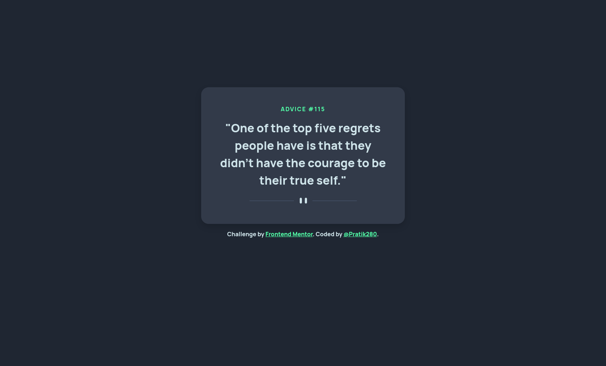

# Frontend Mentor - Advice generator app solution

This is a solution to the [Advice generator app challenge on Frontend Mentor](https://www.frontendmentor.io/challenges/advice-generator-app-QdUG-13db). Frontend Mentor challenges help you improve your coding skills by building realistic projects.

## Table of contents

- [Overview](#overview)
  - [The challenge](#the-challenge)
  - [Links](#links)
  - [Screenshot](#screenshot)
- [My process](#my-process)
  - [Built with](#built-with)
- [Author](#author)

## Overview

### The challenge

Users should be able to:

- View the optimal layout for the app depending on their device's screen size
- See hover states for all interactive elements on the page
- Generate a new piece of advice by clicking the dice icon

### Links

- Solution URL: [Github - Advice Generator App](https://github.com/Pratik280/advice-generator-app)
- Live Site URL: [Github Pages - Advice Generator App](https://pratik280.github.io/advice-generator-app/)

### Screenshot

## My process

### Built with

- Semantic HTML5 markup
- SCSS
- Mobile-first workflow
- [Bootstrap](https://getbootstrap.com/docs/5.0/getting-started/introduction/)
- [React](https://reactjs.org/) - JS library

## Author

- Website - [Add your name here](https://www.your-site.com)
- Frontend Mentor - [@Pratik280](https://www.frontendmentor.io/profile/Pratik280)
